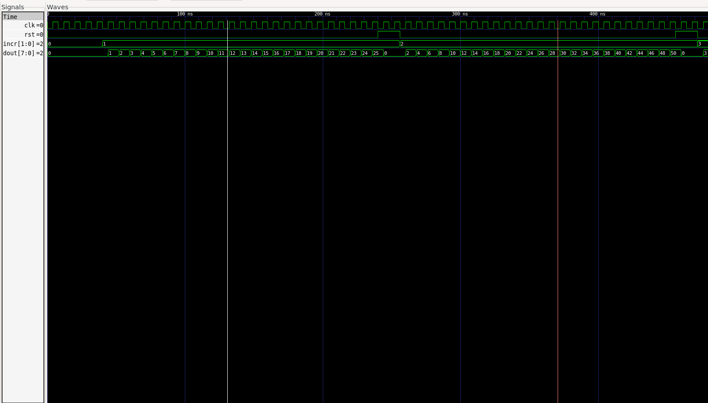
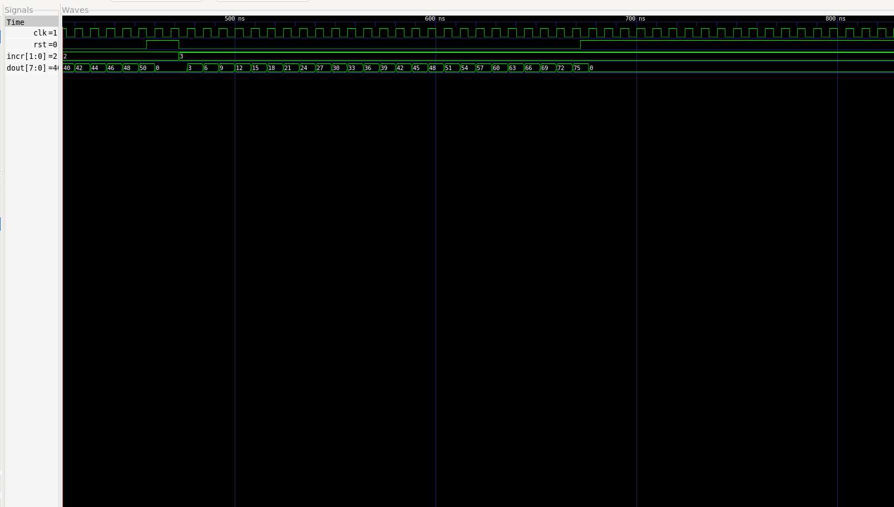

# ECE 410 Assignment 4: Custom Counter
### Part 1: Design an N-bit counter in VHDL with a synchronous reset that can be controlled to increment by 1, 2, 3, or not at all

```vhdl
-- Author: Dion Walton
-- CCID: ddwalton
-- Email: ddwalton@ualberta.ca
-- Student ID: 1761090

LIBRARY IEEE;
USE IEEE.STD_LOGIC_1164.ALL;
USE IEEE.NUMERIC_STD.ALL;

ENTITY counter IS 
    GENERIC (
        g_NUM_BITS : NATURAL := 8
    );

    PORT (
        clk  : IN STD_LOGIC; -- clock
        rst  : IN STD_LOGIC; -- reset to zero signal, active high
        incr : IN STD_LOGIC_VECTOR(1 DOWNTO 0); -- how much to increment by (0, 1, 2, 3)
        dout : OUT STD_LOGIC_VECTOR(g_NUM_BITS - 1 DOWNTO 0) -- counter value
    );
END ENTITY counter;

ARCHITECTURE Behavioral OF counter IS
    SIGNAL count : unsigned(g_NUM_BITS - 1 DOWNTO 0) := (OTHERS => '0'); -- start count as 0
BEGIN
    count_process : PROCESS(CLK)
    BEGIN
        IF (rising_edge(CLK)) THEN
            IF (rst = '1') THEN
                -- synchronous reset
                count <= (OTHERS => '0');
            ELSE
                -- cast incr to unsigned, pad with zeros to match size of output
                count <= count + resize(unsigned(incr), g_NUM_BITS);
            END IF;
        END IF;
    END PROCESS count_process;
    
    -- drive output with internal signal
    dout <= std_logic_vector(count);
END ARCHITECTURE Behavioral;
```

### Part 2: Create a testbench

```vhdl
-- Author: Dion Walton
-- CCID: ddwalton
-- Email: ddwalton@ualberta.ca
-- Student ID: 1761090

LIBRARY IEEE;
USE IEEE.STD_LOGIC_1164.ALL;

ENTITY counter_tb IS
END ENTITY counter_tb;

ARCHITECTURE Behavioral OF counter_tb IS
    CONSTANT c_NUM_BITS : natural := 8;
    SIGNAL clk  : STD_LOGIC := '0';
    SIGNAL rst  : STD_LOGIC := '0';
    SIGNAL incr : STD_LOGIC_VECTOR(1 DOWNTO 0) := "00";
    SIGNAL dout : STD_LOGIC_VECTOR(c_NUM_BITS - 1 DOWNTO 0) := (OTHERS => '0');
BEGIN
    dut : ENTITY WORK.counter(Behavioral)
        GENERIC MAP (g_NUM_BITS => c_NUM_BITS)
        PORT MAP (clk => clk, rst => rst, incr => incr, dout => dout);
    
    -- 125 MHz clock (8 ns period: 4 ns LOW, 4 ns HIGH)
    generate_clk : PROCESS
    BEGIN
        clk <= '0';
        WAIT FOR 4 ns;
        clk <= '1';
        WAIT FOR 4 ns;
    END PROCESS generate_clk;

    test_signals : PROCESS
    BEGIN
        -- all signals are zeroed here, dout should not increment for 40 ns
        WAIT FOR 40 ns; 

        incr <= "01"; -- increment by 1
        -- should increment by 1 200 / 8 = 25 times
        WAIT FOR 200 ns;
        
        rst <= '1'; -- reset to 0
        WAIT FOR 16 ns;
        
        rst <= '0';
        incr <= "10"; -- increment by 2
        WAIT FOR 200 ns; -- should get to 50

        rst <= '1'; -- reset to 0 again
        WAIT FOR 16 ns;

        rst <= '0';
        incr <= "11"; -- increment by 3
        WAIT FOR 200 ns; -- should get to 75

        rst <= '1'; -- hold 0 forever
        WAIT;
    END PROCESS test_signals;
END ARCHITECTURE Behavioral;
```

### Part 3: Simulate as an 8-bit counter

